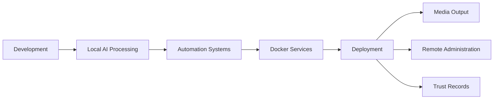

# Apple Device Stack

## Ecosystem Architecture Diagram

```mermaid
flowchart TD
    A[16-inch MacBook Pro M5 Max]\nMobile AI Workstation
    B[Mac mini M4 Pro]\nDedicated Server Node
    C[Magic Keyboard]\nControl Input
    D[Magic Trackpad]\nGesture Control
    E[Thunderbolt 5 Cable]\nHigh-Speed Backbone
    F[Apple TV 4K]\nMedia + Presentation Node

    A --> E
    E --> B
    C --> B
    D --> B
    B --> F

    A --> G[Local LLMs]
    A --> H[DaVinci Resolve]
    A --> I[Docker + Virtualization]

    B --> J[Automation Engine]
    B --> K[AgenticOS Services]
    B --> L[Reverse Proxy + Hosting]
    B --> M[Background Rendering]

    F --> N[Studio Display Output]
    F --> O[Presentation System]
```

---

## Operational Flow Diagram



---

## Primary Mobile Workstation

### 16-inch MacBook Pro — Space Black — M5 Max

**Price:** $6,149.00

### Configuration
- 18-core CPU
- 40-core GPU
- 16-core Neural Engine
- 128GB unified memory
- 4TB SSD storage
- Nano-texture display
- 140W USB‑C Power Adapter
- U.S. English Backlit Magic Keyboard with Touch ID
- Three Thunderbolt 5 ports
- MagSafe 3 port
- HDMI port
- SDXC card slot
- 3.5 mm headphone jack
- Support for up to four external displays

### Intended Usage
- AI development and orchestration
- Local LLM execution
- DaVinci Resolve Studio workflows
- Multi-display workstation deployment
- Docker and virtualization workloads
- High-end software engineering and automation
- Mobile creative workstation

---

## Secondary Desktop Workstation

### Mac mini — M4 Pro

**Price:** $3,299.00

### Configuration
- 14-core CPU
- 20-core GPU
- 16-core Neural Engine
- 48GB unified memory
- 4TB SSD storage
- 10 Gigabit Ethernet
- Two USB‑C ports
- Three Thunderbolt 5 ports
- HDMI port
- Gigabit Ethernet port
- 3.5 mm headphone jack
- Support for up to three external displays

### Intended Usage
- Dedicated server node
- Local AI agent processing
- Build and deployment machine
- Docker and reverse proxy orchestration
- Background rendering and encoding
- Automation host
- Home lab infrastructure

---

## Input and Control Devices

### Magic Keyboard with Touch ID and Numeric Keypad

**Price:** $199.00

### Features
- USB‑C
- Black Keys
- Touch ID
- Numeric keypad
- Apple silicon compatibility
- Desktop workstation control device

---

### Magic Trackpad — Black Multi‑Touch Surface

**Price:** $149.00

### Features
- USB‑C
- Multi‑Touch gesture support
- Precision creative workflow control
- macOS ecosystem integration

---

## Connectivity

### Thunderbolt 5 (USB‑C) Pro Cable — 1 Meter

**Price:** $69.00

### Purpose
- High-speed data transfer
- External display connectivity
- Thunderbolt 5 bandwidth support
- Docking and workstation expansion

---

## Media and Streaming

### Apple TV 4K — Wi‑Fi + Ethernet — 128GB

**Price:** $149.00

### Features
- 128GB storage
- Ethernet support
- Apple ecosystem integration
- Streaming and media management
- AirPlay support

### Intended Usage
- Media server integration
- Presentation display output
- Creative studio streaming
- Home automation ecosystem support

---

## Apple Ecosystem Summary

This hardware stack is designed to operate as a unified Apple Silicon workstation ecosystem optimized for:

- AI infrastructure
- Creative production
- Multi-device orchestration
- Local automation systems
- Software engineering
- Video editing and rendering
- Docker and virtualization
- Trust record management
- Remote administration
- High-speed Thunderbolt workflows

## Estimated Hardware Total

| Device | Cost |
|---|---|
| MacBook Pro M5 Max | $6,149 |
| Mac mini M4 Pro | $3,299 |
| Magic Keyboard | $199 |
| Magic Trackpad | $149 |
| Thunderbolt 5 Cable | $69 |
| Apple TV 4K | $149 |
| **Total** | **$10,014** |
